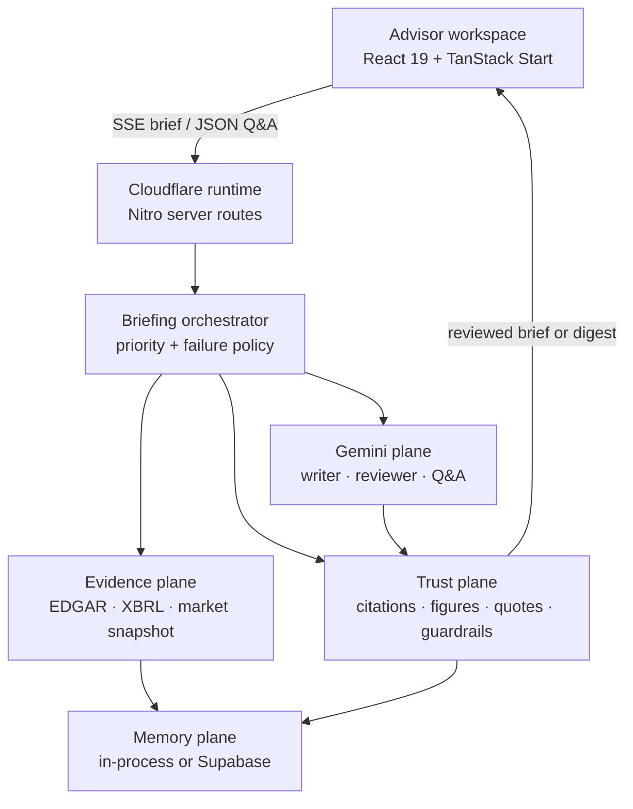
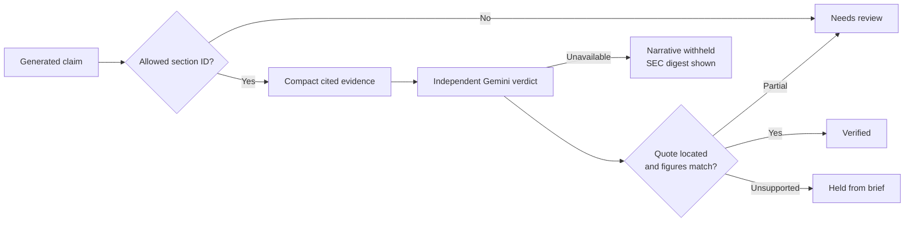

# Advisor Brief

### One minute, one page, every claim traceable to a filing.

[Live application](https://ai-prototype-advisor-brief.lovable.app/) · [Product deck](docs/Advisor_Brief_Deck.pptx) · [Engineering execution brief](docs/ENGINEERING_EXECUTION_PROMPT.md) · [Security policy](SECURITY.md)


Advisor Brief is a full-stack research prototype for the moment a wealth-management client asks about a company the advisor has not reviewed recently. Enter a ticker or company name and the application assembles a live market snapshot, eight quarters of filed results, a concise narrative, material changes, ranked risks, recent 8-K events, talking points, and grounded follow-up answers.

The differentiator is not the summary. It is the evidence path. Every generated claim names the filing section used to write it, passes through an isolated independent review, and remains subject to deterministic citation, quote, and figure checks. If that review cannot complete, the narrative is withheld and the application falls back to a model-free SEC/XBRL digest.

> **Public demonstration exercise.** This repository demonstrates product judgment, client discovery translated into software, grounded AI orchestration, failure-aware engineering, and clear operating controls. It is not investment advice, a research recommendation, or a production compliance system.

## Product thesis

An advisor should not have to choose between reading hundreds of pages and trusting an opaque third-party summary. Advisor Brief is designed around a more useful contract:

| Advisor need                             | Product response                                                     |
| ---------------------------------------- | -------------------------------------------------------------------- |
| Get oriented before the call             | Live quote context and an eight-quarter filed financial view         |
| Understand the current story             | Six concise narrative sections written from recent filings only      |
| Check a statement quickly                | Filing, item, accession, SEC link, and fetch time on every claim     |
| Avoid repeating an unsupported assertion | Independent Gemini review plus deterministic quote and figure checks |
| Continue the conversation                | Session-aware follow-up Q&A grounded in retrieved filing passages    |
| Remain useful during an AI incident      | Deterministic Filing Digest built from SEC EDGAR and XBRL            |

Dark mode is the first-visit default. An explicit light-mode preference is preserved locally.

## Architecture



The server is the trust boundary. `GEMINI_API_KEY` is resolved only from server process variables or Cloudflare/Nitro runtime bindings. It is never stored in a `VITE_` variable, client bundle, browser response, or repository file.

Research, validation, and follow-up answers call Google’s Gemini API directly. There is no Lovable AI gateway, Claude path, Anthropic integration, OpenAI fallback, or silent vendor substitution.

## Request lifecycle

```mermaid
sequenceDiagram
    actor Advisor
    participant API as Briefing API
    participant Evidence as SEC / XBRL / Market
    participant Writer as Gemini writer
    participant Reviewer as Gemini reviewer
    participant Trust as Deterministic verifier
    participant Memory

    Advisor->>API: Ticker or company
    par Authoritative acquisition
        API->>Evidence: Resolve CIK and filings
        API->>Evidence: Fetch facts and quote
    end
    Evidence-->>API: Sections + provenance
    API-->>Advisor: Facts + Filing Digest
    API->>Writer: Citation-constrained six-block brief
    Writer-->>API: Stream narrative blocks
    API-->>Advisor: Render blocks as they arrive
    Note over API,Reviewer: Writer stream closes before review begins
    API->>Reviewer: All claims + compact cited evidence
    Reviewer-->>API: Verdict + verbatim quote per claim
    API->>Trust: Full-text quote, figure, and citation checks
    alt Independent review completed
        Trust-->>Advisor: Reviewed narrative + evidence coverage
        API->>Memory: Cache reviewed result by accessions
    else Review unavailable
        Trust-->>Advisor: Withhold narrative; show SEC digest
    end
```

This sequence is intentionally conservative. The earlier design launched six reviewer calls while the writer stream was open, then started embedding batches against the same key. That fan-out looked responsive on paper but created avoidable quota contention. The current design uses one writer call, one compact review call, and no embedding calls in the default briefing path.

## Multi-agent orchestration

“Agent” describes a bounded responsibility, evidence scope, and failure contract. It does not mean an unconstrained autonomous process.

| Agent                  | Receives                                             | Produces                                                    | Cannot do                                                    |
| ---------------------- | ---------------------------------------------------- | ----------------------------------------------------------- | ------------------------------------------------------------ |
| Evidence agent         | Ticker or company name                               | CIK, filings, sections, XBRL series, market snapshot        | Generate narrative claims                                    |
| Research agent         | Sanitized filing sections and allowed section IDs    | Six structured, cited briefing blocks                       | Use external company knowledge or invent citations           |
| Review agent           | Claims and compact excerpts from cited sections only | Supported, partial, or unsupported verdict plus quote       | See the writer prompt or borrow evidence across claims       |
| Deterministic verifier | Claims, verdicts, full cited text                    | Quote location, figure reconciliation, final display status | Treat a model verdict as self-authenticating                 |
| Retrieval agent        | Accession-keyed filing chunks and a question         | Ranked evidence passages                                    | Answer the advisor directly                                  |
| Q&A agent              | Ranked passages and bounded conversation context     | Short cited answer with evidence quote                      | Recommend a trade, predict returns, or use outside knowledge |
| Guardrail layer        | Inputs, source text, and outputs                     | Refusals, flags, allow-listed citations, audit details      | Be overridden by text found inside a filing                  |

### Model-call budget

The public prototype treats provider capacity as a systems constraint.

| Operation                                |      Default model calls | Scheduling rule                                    |
| ---------------------------------------- | -----------------------: | -------------------------------------------------- |
| Complete briefing                        |                        2 | One writer, then one whole-brief reviewer          |
| Briefing retrieval index                 |                        0 | BM25 is complete by default; embeddings are opt-in |
| Factual follow-up                        |                        1 | Retrieval finishes before Gemini is called         |
| Recommendation or sensitive-data request |                        0 | Refused before inference                           |
| Missing writer block                     | Sequential recovery only | Never fan out against the same key                 |

Transient network errors, `429` responses, and `5xx` responses use bounded exponential backoff with `Retry-After` support. Invalid requests and authentication failures are not retried.

## Evidence and validation model



The displayed percentage is evidence coverage, not a probability that the model is correct. It is calculated only when the independent review returns usable verdicts. A reviewer outage cannot produce a synthetic score, and an entirely unverified brief cannot enter memory.

For each claim, the review path records:

- cited filing section and authoritative SEC URL;
- accession number, form, item, filing date, and fetch time;
- independently returned evidence quote and whether it exists in the full filing text;
- every numeric expression checked and any unmatched figure;
- reviewer model, provider, elapsed time, verdict, and display policy.

Unsupported claims are held by default. Partial and uncited claims remain visibly marked for review. When the independent service fails completely, generated narrative content is removed from the client-facing view rather than covered in warning labels.

## Frontend

The advisor workspace is an information-dense, responsive React application rather than a chat shell.

- Dark-first theme with a persisted light override
- Server-Sent Events for progressive briefing status and narrative blocks
- Market snapshot, 52-week range, and eight-quarter revenue/net-income chart
- Six narrative sections with claim-level evidence state
- Filing links, accession numbers, source sections, and fetch timestamps
- Validation summary with evidence coverage, figure matches, located quotes, and held claims
- Filing Digest fallback with deterministic SEC and XBRL content
- Follow-up Q&A with visible `Gemini · <model>` provenance and filing sources
- Session conversation memory and reviewed-brief replay
- Live pipeline, retrieval mode, and guardrail outcomes for inspection

## Backend and API surface

TanStack Start routes run through Nitro’s Cloudflare module target. A custom server entry copies runtime bindings into a server-only configuration bridge before route handlers are imported.

| Route                              | Method | Contract                                                                                                                    |
| ---------------------------------- | ------ | --------------------------------------------------------------------------------------------------------------------------- |
| `/api/public/advisor-brief?q=NVDA` | `GET`  | SSE stream: resolution, filings, quote, financials, digest, narrative, validation, guardrails, retrieval, usage, completion |
| `/api/public/advisor-ask`          | `POST` | Filing-grounded answer, sources, quote and figure checks, retrieval diagnostics, Gemini provenance, guardrails              |
| `/api/public/advisor-memory`       | `GET`  | Reviewed recent briefings or one ticker/session conversation thread                                                         |

The briefing cache key combines the ticker with the sorted filing accessions used for the request. A new filing creates a new key. Cache eligibility is stricter than key freshness: the narrative must be complete and an independent review must have run.

## Technology stack

| Layer                  | Technology                                                                                   | Responsibility                                                   |
| ---------------------- | -------------------------------------------------------------------------------------------- | ---------------------------------------------------------------- |
| Web application        | React 19, TanStack Start, TanStack Router, TanStack Query                                    | SSR-capable application shell, routing, state, and streaming UI  |
| Design system          | Tailwind CSS 4, Radix UI primitives, Lucide                                                  | Responsive layout, tokens, accessible controls, iconography      |
| Visualization          | Recharts plus purpose-built SVG                                                              | Filed financial trends and market context                        |
| Build and runtime      | TypeScript 5.8, Vite 8, Nitro 3, Cloudflare modules                                          | Compilation, server routes, runtime bindings, edge execution     |
| Narrative and Q&A      | Google Gemini, default `gemini-3.8-flash`                                                    | Filing-grounded writing, independent review, cited follow-ups    |
| Optional embeddings    | `gemini-embedding-001`                                                                       | Semantic retrieval when explicitly enabled                       |
| Authoritative evidence | SEC EDGAR submissions, filing HTML, SEC XBRL Company Facts                                   | Entity resolution, source sections, provenance, filed financials |
| Market snapshot        | Yahoo Finance chart endpoint                                                                 | Prototype price, volume, day range, and 52-week context          |
| Retrieval              | BM25; optional cosine-ranked Gemini vectors                                                  | Bounded passage selection for follow-up questions                |
| Memory                 | In-process store; optional Supabase Postgres                                                 | Reviewed brief replay and bounded conversation history           |
| Verification           | Independent Gemini review plus deterministic TypeScript checks                               | Claim, citation, quote, and figure validation                    |
| Quality                | Node test runner, TypeScript compiler, production build, local and live acceptance harnesses | Regression and release evidence                                  |

## Retrieval and follow-up answers

Filing sections are divided into overlapping passages and indexed lexically with BM25. The public demo defaults to lexical retrieval so semantic indexing cannot consume the same model quota needed for the writer, reviewer, or advisor’s question. Set `ENABLE_EMBEDDINGS=true` to add Gemini vectors and cosine scoring.

For a factual follow-up:

1. retrieve six bounded passages from the same filing corpus;
2. attach at most six recent conversation turns;
3. ask Gemini to answer only from those passages;
4. allow-list returned passage IDs;
5. locate the evidence quote and reconcile figures;
6. screen the answer for advice, forecasts, guarantees, and contact language;
7. display provider/model provenance and linked sources.

“Should I buy this stock?” never reaches Gemini. The deterministic guardrail returns a refusal and redirects the advisor to the filed facts.

## Memory

| State              | Key                               |     Default lifetime | Durable option                      |
| ------------------ | --------------------------------- | -------------------: | ----------------------------------- |
| Reviewed briefing  | Ticker + sorted filing accessions |              6 hours | `advisor_briefings` in Supabase     |
| Conversation turns | Browser session + ticker          |        Last 12 turns | `advisor_conversations` in Supabase |
| Retrieval index    | Briefing key                      | Warm server instance | Rebuilt from filing sections        |

The default in-process store keeps the public demo deployable without a database. For cross-instance persistence, set `MEMORY_BACKEND=supabase` and apply [the idempotent migration](supabase/migrations/20260919000000_advisor_memory.sql). Row Level Security is enabled, no browser access policy is created, and the service role remains server-only.

Unverified, incomplete, and failed narratives are excluded from replay and from the recent-briefings list.

## Guardrails and failure semantics

Guardrails execute in the request path, not as disclaimer copy added after generation.

- Ticker and question shape validation
- Per-client rate limits for briefs and follow-ups
- Rejection of account, card, routing, Social Security, passport, and license identifiers
- Pre-inference refusal of buy/sell/hold requests, price targets, forecasts, and return predictions
- Filing text treated as data and scanned for instruction-shaped content
- Citation allow-listing against sections actually sent to the writer
- Output screening for advice, forecasts, guarantees, and contact language
- Full-text quote location and filing-unit figure reconciliation
- Unsupported-claim hold policy
- Vendor-neutral browser errors with provider details restricted to server logs
- Digest-only fail-closed state when narrative generation or independent review fails

The Filing Digest is not a simulated AI response. Its figures, recent 8-K timeline, filing list, links, and timestamps are assembled directly from EDGAR and XBRL.

## Secret boundary

Runtime configuration is deliberately absent from Git.

- `.env`, `.env.*`, private keys, and certificate bundles are ignored.
- `.env.example` contains names and safe defaults only.
- `npm run security:secrets` rejects tracked runtime files and common credential signatures.
- The Gemini key and optional Supabase service-role key belong only in encrypted server bindings or an ignored `.env.local` file.
- Supabase publishable keys are not privileged, but live project configuration is still kept out of the tracked tree.

See [SECURITY.md](SECURITY.md) for the disclosure and rotation policy.

## Local development

Prerequisites: Node.js 22 or later and a Google AI Studio Gemini API key.

```bash
git clone https://github.com/iamestime/ai-prototype-advisor-brief.git
cd ai-prototype-advisor-brief
npm install
cp .env.example .env.local
```

Set `GEMINI_API_KEY` in `.env.local`, then run:

```bash
npm run dev
```

Never prefix the Gemini key or Supabase service-role key with `VITE_`.

### Configuration

| Variable                    | Required               | Default                           | Purpose                                              |
| --------------------------- | ---------------------- | --------------------------------- | ---------------------------------------------------- |
| `GEMINI_API_KEY`            | For narrative features | None                              | Server-only Gemini credential                        |
| `GEMINI_BASE_URL`           | No                     | Google OpenAI-compatible endpoint | Direct Gemini transport                              |
| `AI_MODEL`                  | No                     | `gemini-3.8-flash`                | Writer and follow-up model                           |
| `VALIDATOR_MODEL`           | No                     | `gemini-3.8-flash`                | Independent reviewer model                           |
| `AI_MAX_ATTEMPTS`           | No                     | `4`                               | Bounded attempts for retryable calls; capped at five |
| `AI_CALL_GAP_MS`            | No                     | `750`                             | Gap between writer completion and independent review |
| `VALIDATION_POLICY`         | No                     | `exclude`                         | Hold or flag unsupported claims                      |
| `UNVERIFIED_POLICY`         | No                     | `hide`                            | Hide claims without a completed review               |
| `ENABLE_EMBEDDINGS`         | No                     | `false`                           | Add Gemini vectors to BM25 retrieval                 |
| `EMBED_MODEL`               | With embeddings        | `gemini-embedding-001`            | Semantic retrieval model                             |
| `EDGAR_USER_AGENT`          | Recommended            | Project contact page              | SEC-compliant request identity                       |
| `MEMORY_BACKEND`            | No                     | `memory`                          | `memory` or `supabase`                               |
| `SUPABASE_URL`              | With durable memory    | None                              | Server-side Supabase project URL                     |
| `SUPABASE_SERVICE_ROLE_KEY` | With durable memory    | None                              | Server-only memory-table access                      |
| `DEBUG_ERRORS`              | No                     | `false`                           | Internal diagnostics; keep false publicly            |

Timeouts, rate limits, and memory TTL are documented in [.env.example](.env.example).

## Verification

```bash
npm run security:secrets
npm test
npm run typecheck
npm run build
npm run test:smoke
```

The GitHub Actions quality gate runs secret scanning, tests, type-checking, and the production build on every push to `main` and every pull request.

The focused suite covers runtime-binding discovery, Gemini-only provider selection, retry recovery after throttling, arbitrary streaming chunk boundaries, fenced and formatted JSON, citation allow-listing, empty-block rejection, compact evidence selection, one-call whole-brief review, filing-unit figure reconciliation, quote location, and dark-first rendering.

`npm run test:smoke` starts a local Gemini-compatible service while retaining the real SEC and market-data pipeline. It proves six streamed blocks, completed independent validation, optional hybrid retrieval, a sourced Gemini follow-up, and a pre-inference recommendation refusal.

After a release reaches the public deployment:

```bash
npm run test:live
```

The live acceptance harness runs fresh briefings for LLY, BA, NVDA, and ORCL, requires six blocks and a completed Gemini review for each, checks for a numeric evidence-coverage score, verifies one factual cited follow-up, and confirms that a recommendation request is refused without inference.

## Repository map

```text
src/server.ts                                Cloudflare/Nitro runtime-binding entry
src/routes/index.tsx                         Advisor workspace and streaming client
src/routes/api/public/advisor-brief.ts       Quota-aware briefing orchestrator
src/routes/api/public/advisor-ask.ts         Gemini filing-grounded follow-up Q&A
src/routes/api/public/advisor-memory.ts      Reviewed memory and conversation API
src/server/runtime-env.ts                    Server-only environment bridge
src/server/advisor/edgar.ts                  SEC, XBRL, market, and section extraction
src/server/advisor/research.ts               Narrative writer and brace-aware stream parser
src/server/advisor/validation.ts             Compact independent review and deterministic checks
src/server/advisor/retrieval.ts              Passage chunking, BM25, optional embeddings
src/server/advisor/guardrails.ts              Input, source, output, and compliance controls
src/server/advisor/memory.ts                 In-process and Supabase memory adapters
src/server/advisor/digest.ts                 Model-free SEC/XBRL fallback
scripts/check-secrets.mjs                    Tracked-tree credential gate
scripts/live-acceptance.mjs                  Four-ticker production acceptance matrix
supabase/migrations/                         Optional durable-memory schema
tests/                                       Focused regression suite
docs/Advisor_Brief_Deck.pptx                 Product and pilot presentation
```

## Deployment contract

1. GitHub `main` is the source of truth. Release a reviewed commit without editing through Lovable.
2. Configure `GEMINI_API_KEY` as an encrypted server runtime binding.
3. Run the secret, unit, type, build, and local smoke gates.
4. Confirm the connected deployment is serving the release asset, not merely that GitHub accepted the commit.
5. Run the four-ticker live acceptance matrix.
6. Inspect one claim’s filing link, quote, figures, accession, and fetch time.
7. Ask one factual question and one prohibited recommendation question.
8. Confirm dark mode before hydration in a clean browser profile.

## Productionization boundary

The public prototype favors inspectability and fast client learning. A regulated production deployment would additionally require authenticated advisor identities, tenant isolation, licensed market data, centralized rate limiting, durable provider queues, immutable audit retention, formal model-risk approval, versioned prompts and evaluation datasets, distributed tracing, SLOs, disaster recovery, accessibility certification, penetration testing, and compliance-owned retention policies.

The current repository should not be represented as satisfying those controls.

## Presentation

The eight-slide [Advisor Brief product deck](docs/Advisor_Brief_Deck.pptx) covers the advisor problem, one-minute workflow, evidence model, follow-up memory, guardrails, operating impact, and proposed four-week pilot.

## Project lead

**Estimé Aristomene, Jr.**<br>
Managing Director, Principal Engineer at AiQorx<br>
[Contact AiQorx](https://aiqorx.com/contact)
