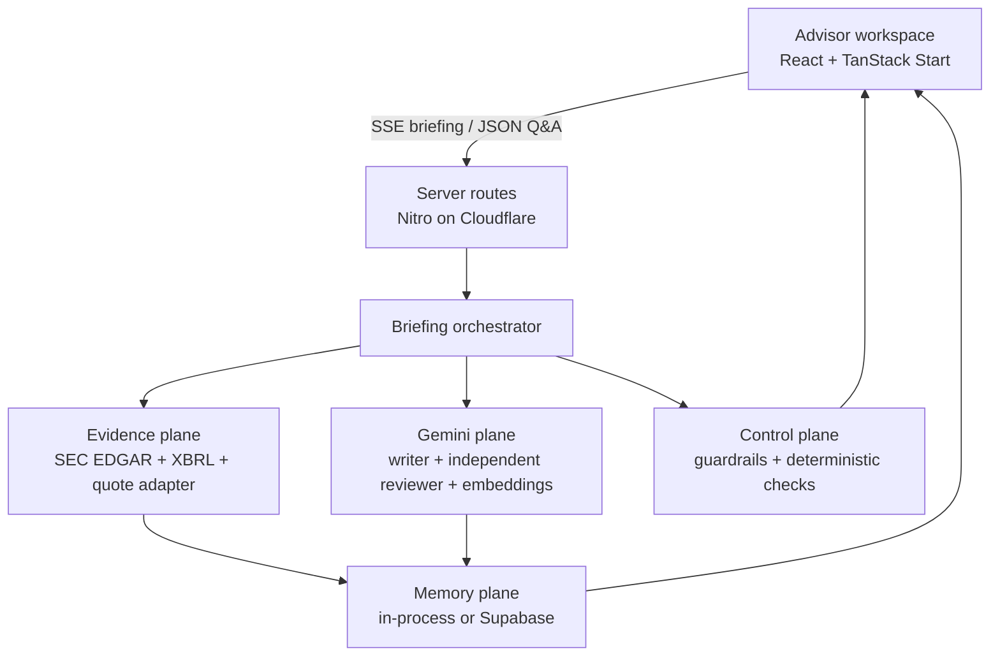
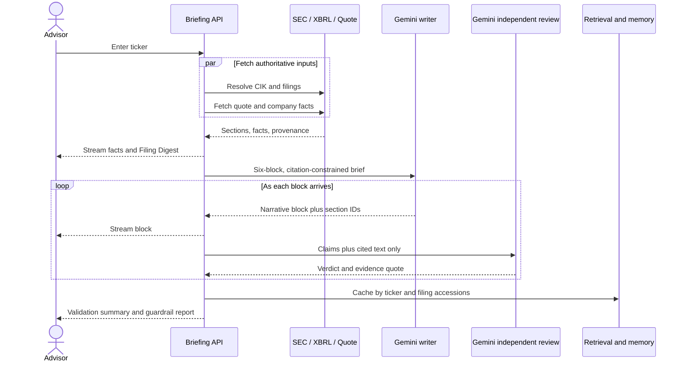
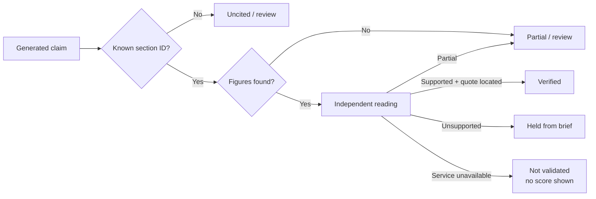

# Advisor Brief

**One minute, one page, every claim traceable to a filing.**

[Live application](https://ai-prototype-advisor-brief.lovable.app/) · [Product deck](docs/Advisor_Brief_Deck.pptx) · [Engineering execution brief](docs/ENGINEERING_EXECUTION_PROMPT.md)


Advisor Brief is a full-stack research prototype for wealth management advisors. Enter a ticker or company name and it assembles a live market snapshot, eight quarters of filed results, a concise narrative, ranked risks, recent 8-K events, client-ready talking points, and grounded follow-up answers. Generated claims link back to the exact SEC filing sections used to write them and pass through a separate evidence-scoped review before they appear as verified.

This repository is a **public demonstration exercise**, not a production advisory system. It is designed to show product judgment, systems thinking, grounded AI orchestration, failure-aware engineering, and clear client communication in a Forward Deployed Engineering context. It does not provide investment advice.

## What the prototype proves

The product is built around a specific operating moment: a client asks about a company the advisor has not reviewed recently, and the advisor has minutes rather than hours to prepare.

| Advisor need | Product response |
| --- | --- |
| Get oriented quickly | Live quote, valuation context, and an eight-quarter revenue/net-income view |
| Understand the current story | A 60-second summary, latest-quarter changes, ranked risks, and recent events |
| Know where each statement came from | Claim-level filing citations with accession, section, URL, and fetch time |
| Avoid confidently repeating an error | Independent evidence-scoped review plus deterministic figure and quote checks |
| Continue the conversation | Filing-grounded questions with session memory and hybrid retrieval |
| Remain useful during an AI outage | A deterministic Filing Digest built directly from EDGAR and XBRL |

Dark mode is the first-run default. An explicit light-mode choice is preserved in local storage.

## System architecture



The server is the trust boundary. `GEMINI_API_KEY` is read only from server runtime bindings or `process.env`; it is never exposed through a `VITE_` variable or returned to the browser. Research, validation, embeddings, and follow-up answers all call Google's Gemini endpoint directly. There is no Lovable AI gateway, Claude path, or silent model-vendor fallback.

### Briefing orchestration



The orchestration is deliberately role-separated:

1. **Data agent** resolves the registrant, selects the latest 10-K and 10-Q plus recent 8-Ks, extracts filing sections, and builds structured financials.
2. **Research agent** writes six JSON briefing blocks from only those sections. Its streaming parser is brace-aware, so provider chunk boundaries, pretty-printed JSON, and markdown fences cannot silently discard the narrative.
3. **Validation agent** receives claims and their cited text, but not the writer's full prompt. It is told to assume each claim may be wrong and must return a verdict plus a short verbatim evidence quote.
4. **Deterministic verifier** checks citation IDs, locates the returned quote, reconciles stated figures against filing text, and applies the hold/flag policy.
5. **Retrieval agent** chunks the same source corpus, builds BM25 plus Gemini embeddings, and supplies a bounded evidence set for follow-up questions.
6. **Guardrail layer** rejects sensitive client identifiers and trade recommendations before inference, neutralizes instruction-shaped filing text, rate-limits requests, and screens generated language.

Independent reviews run with bounded concurrency, and Gemini calls retry transient `429` and `5xx` responses with capped exponential backoff. Embedding work begins after the advisor-facing writing and review calls, preventing background retrieval from consuming the request's model quota at the wrong moment.

## Claim trust model



The displayed percentage is evidence coverage, not model confidence. A score is emitted only when the independent reading actually ran. Unsupported claims are held aside under the default policy; a validator outage never creates a synthetic score.

## Frontend

The interface is a responsive, single-page advisor workspace built with React 19, TanStack Router, Tailwind CSS 4, and Recharts.

- Dark-first theme with a persisted light-mode override
- Live pipeline log and status updates over Server-Sent Events
- Market snapshot, 52-week range, and filed financial trend chart
- Six narrative sections with claim-level validation state
- Linked filing metadata, accession numbers, and fetch timestamps
- Held-for-review drawer for unsupported, unverified, or compliance-flagged claims
- Follow-up Q&A with visible Gemini model provenance, retrieval mode, evidence quotes, and source links
- Deterministic Filing Digest during model unavailability
- Session memory and recent-briefing replay

## Backend and API surface

TanStack Start routes execute through Nitro's Cloudflare module target. The custom server entry captures runtime bindings before route configuration is read, which keeps encrypted deployment secrets server-side while making them available consistently in the worker runtime.

| Route | Method | Contract |
| --- | --- | --- |
| `/api/public/advisor-brief?q=NVDA` | `GET` | SSE stream containing resolution, filings, quote, financials, digest, narrative blocks, validation, guardrails, retrieval index, usage, and completion events |
| `/api/public/advisor-ask` | `POST` | Filing-grounded answer with citations, source metadata, deterministic checks, retrieval diagnostics, model provenance, and guardrail results |
| `/api/public/advisor-memory` | `GET` | Recent briefings or one ticker/session conversation thread; also reports memory backend and AI readiness |

The briefing key includes the ticker and every filing accession read. A new filing therefore invalidates an old briefing without relying on an arbitrary cache purge.

## Data and model stack

| Layer | Technology | Responsibility |
| --- | --- | --- |
| Web application | React 19, TanStack Start, TanStack Router, TanStack Query | SSR-capable application shell, routing, state, and streaming UI |
| Styling and charts | Tailwind CSS 4, Recharts | Responsive design system and financial visualization |
| Runtime | TypeScript 5.8, Vite 8, Nitro 3 | Build, server routing, and Cloudflare module output |
| Generative model | Google Gemini `gemini-3.8-flash` | Narrative writing, independent review, and grounded Q&A |
| Embeddings | Google Gemini `gemini-embedding-001` | Semantic retrieval for filing passages |
| Primary evidence | SEC EDGAR submissions, filing HTML, SEC XBRL Company Facts | Company identity, filings, sections, financial facts, and source provenance |
| Market snapshot | Yahoo Finance chart endpoint | Prototype quote, volume, day range, and 52-week range |
| Retrieval | BM25 plus cosine-ranked Gemini vectors | Evidence selection for follow-up questions |
| Memory | In-process store; optional Supabase Postgres | Briefing replay and bounded conversation history |
| Verification | Independent Gemini call plus deterministic TypeScript checks | Claim, quote, figure, and citation validation |
| Quality | Node test runner, TypeScript compiler, ESLint, Prettier | Regression, type, and style checks |

## Memory design

Three kinds of state are intentionally separate:

| State | Key | Lifetime | Durable option |
| --- | --- | --- | --- |
| Completed briefing | Ticker plus sorted filing accessions | Six hours by default | `advisor_briefings` in Supabase |
| Conversation turns | Browser session plus ticker | Last 12 turns | `advisor_conversations` in Supabase |
| Retrieval index | Filing-accession briefing key | Warm server instance | Rebuilt from cached filing sections |

The default in-process backend is appropriate for the public demo and requires no database. Set `MEMORY_BACKEND=supabase` and apply [the migration](supabase/migrations/20260919000000_advisor_memory.sql) for cross-instance persistence. Row Level Security is enabled and no browser policies are created; these tables are accessed with the server-only service role.

## Guardrails and graceful degradation

Guardrails are part of the request path rather than a disclaimer added after generation.

- Ticker and question shape validation
- Per-client token-bucket rate limits
- Social Security, card, account, routing, passport, and license-number rejection before a model call
- Deterministic refusal of buy, sell, hold, price-target, and return-prediction requests
- Filing text isolated as data and sanitized for instruction-shaped lines
- Citation allow-listing against sections actually sent to the model
- Generated advice, forecast, guarantee, and off-platform contact screening
- Figure reconciliation and evidence-quote location checks
- Unsupported-claim hold policy and explicit unverified state
- Vendor-neutral client errors with detailed provider failures confined to server logs
- Filing Digest fallback from EDGAR and XBRL when Gemini is unavailable

## Local development

Prerequisites: Node.js 22 or later and a Google AI Studio Gemini API key.

```bash
git clone https://github.com/iamestime/ai-prototype-advisor-brief.git
cd ai-prototype-advisor-brief
npm install
cp .env.example .env.local
```

Set `GEMINI_API_KEY` in `.env.local`, then start the application:

```bash
npm run dev
```

Do not place the key in browser code, commit it, or prefix it with `VITE_`.

### Configuration

| Variable | Required | Default | Purpose |
| --- | --- | --- | --- |
| `GEMINI_API_KEY` | Yes for narrative features | None | Server-only Google Gemini credential |
| `AI_MODEL` | No | `gemini-3.8-flash` | Research and follow-up model |
| `VALIDATOR_MODEL` | No | `gemini-3.8-flash` | Independent reviewer model |
| `EMBED_MODEL` | No | `gemini-embedding-001` | Retrieval embedding model |
| `AI_MAX_ATTEMPTS` | No | `3` | Total attempts for retryable Gemini calls, capped at four |
| `EDGAR_USER_AGENT` | Strongly recommended | Project contact page | SEC-compliant request identity |
| `VALIDATION_POLICY` | No | `exclude` | Hold or flag unsupported claims |
| `UNVERIFIED_POLICY` | No | `flag` | Show or hide claims when the reviewer is unavailable |
| `MEMORY_BACKEND` | No | `memory` | `memory` or `supabase` |
| `SUPABASE_URL` | With durable memory | None | Supabase project URL |
| `SUPABASE_SERVICE_ROLE_KEY` | With durable memory | None | Server-only key for memory tables |
| `DEBUG_ERRORS` | No | `false` | Include provider attempt detail in API diagnostics; keep false publicly |

Timeouts, rate limits, and the memory TTL are also documented in [.env.example](.env.example).

## Verification

```bash
npm test
npm run test:smoke
npm run typecheck
npm run build
```

The focused regression suite covers:

- Cloudflare runtime-binding discovery for `GEMINI_API_KEY`
- Gemini-only provider selection
- Retry behavior after transient throttling
- Six-block streamed narrative recovery across arbitrary chunk boundaries
- Pretty-printed and fenced JSON extraction
- Empty-block rejection and citation allow-listing
- Filing-unit figure reconciliation
- Evidence-quote location

`npm run test:smoke` starts the application with a local Gemini-compatible test double while retaining the real SEC and market-data pipeline. It verifies all six streamed blocks, completed independent validation, hybrid retrieval, a sourced Gemini follow-up answer, and a pre-inference recommendation refusal.

## Repository map

```text
src/routes/index.tsx                         Advisor workspace and streaming client
src/routes/api/public/advisor-brief.ts       Briefing orchestrator and SSE contract
src/routes/api/public/advisor-ask.ts         Grounded follow-up Q&A
src/server/runtime-env.ts                    Worker runtime-binding bridge
src/server/advisor/edgar.ts                  SEC, XBRL, quote, and section extraction
src/server/advisor/research.ts               Narrative writer and resilient stream parser
src/server/advisor/validation.ts             Independent reviewer and deterministic checks
src/server/advisor/retrieval.ts              Chunking, BM25, embeddings, and hybrid search
src/server/advisor/guardrails.ts              Input, source, output, and compliance controls
src/server/advisor/memory.ts                 Briefing, conversation, and retrieval memory
src/server/advisor/digest.ts                 Model-free fallback
supabase/migrations/                         Optional durable-memory schema
tests/                                       Focused regression suite
docs/Advisor_Brief_Deck.pptx                 Product and pilot presentation
```

## Deployment contract

1. Deploy from a reviewed GitHub commit; GitHub is the source of truth.
2. Add `GEMINI_API_KEY` as an encrypted **server runtime binding**, not a client or build-time variable.
3. Set an identifiable `EDGAR_USER_AGENT`.
4. Run `npm test`, `npm run test:smoke`, `npm run typecheck`, and `npm run build` before release.
5. Verify a fresh briefing emits all six blocks, a validation summary with `validatorRan: true`, a non-null supported percentage, and a Gemini provider label.
6. Ask one factual follow-up and one prohibited recommendation question. Confirm the first cites a filing and the second is refused without inference.
7. Confirm first-visit dark mode and the persisted theme override in a clean browser profile.

## Productionization boundary

This public prototype intentionally favors inspectability over enterprise complexity. A regulated production deployment would additionally require authenticated advisor identities, tenant isolation, centralized rate limiting, licensed market data, immutable audit retention, formal model-risk approval, prompt and model version registries, distributed tracing, SLOs, disaster recovery, accessibility certification, penetration testing, and compliance-owned retention policies. The current system should not be represented as satisfying those controls.

## Presentation

The eight-slide [Advisor Brief product deck](docs/Advisor_Brief_Deck.pptx) covers the advisor problem, one-minute workflow, evidence model, follow-up memory, guardrails, operating impact, and proposed four-week pilot.

## Project lead

**Estimé Aristomene, Jr.**<br>
Managing Director, Principal Engineer at AiQorx<br>
[Contact AiQorx](https://aiqorx.com/contact)
